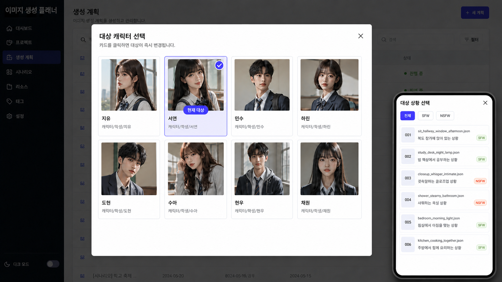

# 플래너 대상 선택 모달 구현 계획

작성일: 2026-08-14

## 1. 목적

플래너 화면의 `대상 캐릭터`, `대상 상황` 드롭다운을 카드형 선택 모달로 교체한다.

현재 드롭다운은 항목 이름만 한 줄로 보여 주기 때문에 다음 문제가 있다.

- 캐릭터가 많아질수록 이름만 보고 대상을 구분하기 어렵다.
- 캐릭터 대표 이미지, 캐릭터 경로, 상황 번호, 등급 등 이미 존재하는 식별 정보를 선택 과정에서 활용하지 못한다.
- 긴 상황 이름과 파일명이 한 줄 option 안에서 잘리거나 빠르게 비교하기 어렵다.
- 모바일에서 native select의 표현과 조작 방식이 브라우저마다 달라 일관성이 낮다.
- 선택 즉시 캐릭터 데이터 전체를 다시 불러오기 때문에 실수로 다른 캐릭터를 누르면 불필요한 전환 비용이 발생한다.

새 모달은 항목을 시각적으로 비교하고, 카드를 한 번 누르는 즉시 최종 대상을 명확하게 바꾸는 것을 목표로 한다.

## 2. 현재 구현 분석

### 2.1 교체 대상

`public/js/project/planner.js`의 `renderPlannerPanel()` 안에 다음 두 선택기가 있다.

| 현재 요소 | 표시 조건 | 변경 이벤트 | 실제 상태 |
| --- | --- | --- | --- |
| `planner-character-select` | 캐릭터 기준 또는 실행 화면 | `cachePlannerCharacterSelection()` | `window.PROJECT_PLANNER_SELECTED_CHARACTER_ID`, 프로젝트별 localStorage 캐시 |
| `planner-situation-scope-select` | 플랜/결과 화면의 상황 기준 | `selectPlannerSituationScope(value)` | `window.PROJECT_PLANNER_SELECTED_SITUATION_ID` |

캐릭터 변경은 `loadPlannerForSelectedCharacter()`를 호출해 캐릭터 meta, 캐릭터 파일, planner meta, 프로젝트 스타일과 배경 정보를 다시 불러온다. 상황 변경은 선택 ID를 갱신한 뒤 플래너 섹션을 다시 렌더링한다.

### 2.2 유지해야 할 상태 규칙

- 캐릭터 선택의 프로젝트별 localStorage 캐시는 유지한다.
- 캐릭터 ID fallback 순서는 현재 `getSelectedPlannerCharacterId()` 계약을 유지한다.
- 상황 ID가 없거나 삭제됐으면 프로젝트의 첫 번째 상황을 선택하는 현재 fallback을 유지한다.
- `캐릭터 기준 | 상황 기준` 전환 상태는 이번 작업에서 변경하지 않는다.
- 플랜, 실행 큐, 결과 선택, 생성 API, D1/R2 데이터 구조는 변경하지 않는다.

### 2.3 참고할 기존 UI

새 모달은 플래너 내부에 이미 있는 다음 UI를 조합해 만든다.

| 참고 UI | 재사용할 패턴 |
| --- | --- |
| `renderPlannerSettingsModal()` | `bg-black/60`, `backdrop-blur-sm`, `rounded-xl`, 패널과 헤더 구분 |
| `renderPlannerSituationPlanModal()` | `max-h-[90vh]`, `flex flex-col`, 스크롤 가능한 본문, 큰 화면용 `max-w-5xl` |
| `renderPlannerResultModal()` | 이미지 카드 그리드, 인디고 테두리와 ring을 이용한 선택 표시, 하단 선택 상태 문구 |
| 캐릭터 목록 화면 | 4:5 대표 이미지, 이름, 폴더 경로, 이미지 오류 fallback |
| 상황 목록 화면 | 이미지 번호 타일, `SFW/NSFW` 배지, 파일명과 상황명 중심의 텍스트 카드 |

기존 모달의 시각 언어는 유지하되, 접근성에 필요한 `role="dialog"`, `aria-modal`, 포커스 복원은 이번 모달부터 명시적으로 보강한다.

## 3. 범위

### 3.1 포함 범위

1. 플래너 헤더의 native select 두 개를 현재 선택 대상을 보여 주는 버튼으로 교체한다.
2. 캐릭터와 상황에 함께 사용할 단일 대상 선택 모달을 추가한다.
3. 캐릭터 카드에 대표 이미지, 이름, 경로를 표시한다.
4. 상황 카드에 이미지 번호, 파일명, 상황명, 등급을 표시한다.
5. 상황에는 `전체`, `SFW`, `NSFW` 필터를 제공한다.
6. 카드를 클릭하면 즉시 실제 화면 상태를 바꾸고 모달을 닫는다.
7. 로딩, 빈 목록, 대표 이미지 로드 실패 상태를 제공한다.
8. 모바일 레이아웃과 키보드/스크린리더 동작을 정의한다.

### 3.2 제외 범위

1. 다중 캐릭터 또는 다중 상황 선택
2. 모달 안에서 캐릭터/상황 추가, 수정, 삭제
3. 캐릭터 variant 또는 상황 prompt variant 선택
4. 플랜 카드와 결과 카드의 레이아웃 변경
5. 서버 API, D1 migration, R2 key 구조 변경
6. 프로젝트 전체에서 사용 중인 다른 select를 일괄 교체하는 작업

## 4. 확정 UI 구조

### 4.1 플래너 헤더의 선택 트리거

기존 select 자리에는 native `button`을 둔다.

캐릭터 기준 표시 내용:

```text
대상 캐릭터
[작은 대표 이미지] 캐릭터 이름
                  폴더 경로                         [chevrons-up-down]
```

상황 기준 표시 내용:

```text
대상 상황
[007] 상황 이름
      007.webp · SFW                                [chevrons-up-down]
```

규칙:

- 기존 최소 너비 `180px`, 데스크톱 `240px` 문맥을 유지한다.
- 좁은 화면에서는 헤더 안에서 가능한 너비를 모두 사용한다.
- 현재 값은 버튼 자체에서 항상 확인할 수 있어야 한다.
- 선택할 항목이 없으면 버튼을 disabled 처리하고 `캐릭터 없음` 또는 `상황 없음`을 표시한다.
- `aria-haspopup="dialog"`, `aria-expanded`, `aria-controls="planner-target-picker-modal"`을 사용한다.

### 4.2 모달 공통 골격

```text
+------------------------------------------------------------------+
| 대상 캐릭터 선택                                      [닫기 X]  |
| 플래너에 사용할 캐릭터 한 명을 선택하세요.                       |
+------------------------------------------------------------------+
| [카드] [선택 카드] [카드] [카드]                                |
| [카드] [카드]      [카드] [카드]          <- 스크롤 본문         |
|                                                                  |
+------------------------------------------------------------------+
```

공통 레이아웃:

- 백드롭: `fixed inset-0 z-50 bg-black/60 backdrop-blur-sm p-3 sm:p-4`
- 패널: `w-full max-w-4xl max-h-[88vh] rounded-xl border shadow-2xl flex flex-col`
- 헤더: 제목, 한 줄 설명, 닫기 버튼, 하단 border
- 상황 등급 필터: 상황 모드 본문 상단에 표시
- 목록: `min-h-0 flex-1 overflow-y-auto`
- 별도 선택 요약이나 확인 푸터는 두지 않는다.
- 배경 클릭과 X/Escape는 대상을 바꾸지 않고 닫는다.

### 4.3 캐릭터 선택 모드

- 데스크톱: 4열, 태블릿: 3열, 모바일: 2열 카드 그리드
- 카드 비율은 기존 캐릭터 목록처럼 이미지 중심의 4:5 구성을 사용한다.
- 대표 이미지는 `getAssetUrl(character.coverImage)`를 사용한다.
- 이미지 아래에 캐릭터 표시 이름과 폴더 경로를 한 줄씩 표시한다.
- 이미지 실패 시 기존 캐릭터 목록과 같은 `image-off` 아이콘 fallback을 표시한다.
- 현재 적용된 캐릭터에는 인디고 border, `ring-2`, 연한 인디고 배경, check 아이콘과 `현재 대상` 배지를 함께 표시한다.
- 다른 카드를 클릭하면 별도의 중간 선택 상태를 표시하지 않고 즉시 적용 후 모달을 닫는다.

### 4.4 상황 선택 모드

- 기존 상황 목록의 텍스트 중심 카드 스타일을 사용한다.
- 데스크톱 3열, 태블릿 2열, 모바일 1열을 기본으로 한다.
- 카드에는 이미지 번호 타일, `{번호}.webp`, `SFW/NSFW` 배지, 상황명을 표시한다.
- 선택 판단에 특정 캐릭터 이미지가 필요하지 않도록 상황 대표 이미지는 사용하지 않는다.
- `전체`, `SFW`, `NSFW` 필터는 작은 segmented button으로 제공한다.

### 4.5 반응형 규칙

데스크톱:

- 넓은 카드 그리드를 사용하고 카드 목록이 패널 하단까지 이어지게 한다.
- 모달 바깥의 플래너는 dim 처리하되 현재 화면 문맥이 약하게 보이도록 한다.

모바일:

- 패널은 화면 높이를 대부분 사용하고 `max-h-[94vh]`로 완화한다.
- 제목과 닫기 버튼, 상황 등급 필터는 스크롤 영역 밖에 둔다.
- 별도 하단 액션 영역을 만들지 않아 카드 목록에 더 많은 공간을 제공한다.
- 상황 카드는 1열, 캐릭터 카드는 최소 2열을 유지하되 360px 미만에서는 카드 텍스트가 두 줄을 넘지 않게 한다.

## 5. 레이아웃 시안



이 이미지는 구현 구조를 검토하기 위한 참고 시안이다. 실제 구현은 현재 프로젝트 데이터, Tailwind class, 다크 모드, 기존 아이콘을 사용한다. 시안의 배경 내비게이션과 예시 인물은 구현 대상이 아니며, 모달의 정보 계층과 반응형 배치만 참고한다.

## 6. 상태 설계

전역에는 모달이 열려 있는 동안만 필요한 작은 UI 상태를 둔다.

```js
window.PROJECT_PLANNER_TARGET_PICKER = {
    open: false,
    projectId: '',     // 모달을 연 프로젝트
    type: 'character', // 'character' | 'situation'
    selectedId: '',    // 모달을 열 때의 현재 적용값
    rating: 'all',     // 상황 모드에서만 사용
    triggerId: ''      // 닫을 때 포커스를 복원할 버튼
};
```

원칙:

- `selectedId`는 현재 대상 강조와 같은 카드를 다시 클릭했는지 판단하는 데 사용한다.
- 카드 클릭 없이 모달을 닫을 때는 실제 플래너 상태를 변경하지 않는다.
- 카드 클릭 처리가 시작되면 picker 상태를 초기화하고, 대상 적용과 화면 갱신 후 trigger로 포커스를 복원한다.
- 플래너 섹션 재렌더링으로 trigger DOM이 교체될 수 있으므로 복원할 때 ID로 새 요소를 다시 찾는다.
- 모달 상태는 localStorage에 저장하지 않는다.

## 7. 렌더링 및 이벤트 설계

### 7.1 신규 렌더러

`public/js/project/planner.js`에 다음 책임을 분리한다.

```text
renderPlannerTargetTrigger(type, selectedItem)
renderPlannerTargetPickerModal()
renderPlannerCharacterPickerCards(characters, state)
renderPlannerSituationPickerCards(project, situations, state)
renderPlannerTargetPickerOverlay()
```

카드 렌더러는 모달 상태를 읽되 플래너 실제 선택 상태를 직접 변경하지 않는다. 빈 목록과 필터 결과 없음은 기존 `renderEmptyState()`를 재사용한다.

### 7.2 신규 이벤트

```text
openPlannerTargetPicker(type)
closePlannerTargetPicker(event?)
setPlannerTargetPickerRating(rating)
applyPlannerTargetPickerSelection(targetId)
handlePlannerTargetPickerKeydown(event)
```

`public/js/main.js`가 `project.js`의 export를 `window`에 합치는 현재 구조를 유지하므로, 위 함수는 `planner.js`에서 named export로 제공한다. 별도의 inline script나 새 전역 번들은 추가하지 않는다.

### 7.3 오버레이 루트

기존 `ensurePlannerOverlayRoot()`를 재사용해 `document.body` 바로 아래에 다음 root를 만든다.

```text
planner-target-picker-overlay-root
```

이 방식은 모달을 `renderPlannerPanel()` 내부에 중첩했을 때 발생할 수 있는 `overflow-hidden` 잘림과 섹션 재렌더링에 따른 비정상 닫힘을 피하고, 결과/미리보기/실행 확인 모달과 같은 생명주기를 갖게 한다.

picker를 열거나 닫을 때 전용 overlay 렌더러를 직접 호출한다. 프로젝트 전환이나 다른 프로젝트 화면으로 이동할 때는 picker 상태를 초기화하고 overlay를 비운다.

## 8. 카드 클릭 즉시 적용 데이터 흐름

### 8.1 캐릭터

```text
트리거 클릭
-> 현재 캐릭터 ID를 selectedId로 보관
-> 캐릭터 카드 탐색
-> 카드 클릭
-> setCachedPlannerCharacterId(project, targetId)
-> window.PROJECT_PLANNER_SELECTED_CHARACTER_ID = targetId
-> 모달 닫기
-> loadPlannerForSelectedCharacter()
-> 캐릭터 meta/files, planner meta, 스타일/배경 재동기화
-> 플래너 재렌더링
```

보호 규칙:

- `targetId === selectedId`이면 네트워크 재로딩 없이 모달만 닫는다.
- 존재하지 않는 캐릭터 ID는 적용하지 않고 모달을 닫은 뒤 `planner-status`로 안내한다.
- 카드 클릭과 동시에 overlay를 비워 중복 클릭을 막는다.
- 로딩 실패 시 현재의 `loadPlannerForSelectedCharacter()` 오류 표시 계약을 사용하되 선택 ID와 캐시는 유지한다. 사용자는 다시 열어 다른 캐릭터를 선택할 수 있다.

### 8.2 상황

```text
트리거 클릭
-> 현재 상황 ID를 selectedId로 보관
-> 상황 카드 탐색
-> 카드 클릭
-> window.PROJECT_PLANNER_SELECTED_SITUATION_ID = targetId
-> 모달 닫기
-> renderPlannerSectionByState({ preserveScroll: true })
```

상황 변경에는 신규 API 요청이 없다. 상황 기준용 캐릭터별 데이터는 기존 `setPlannerPlanScope()`와 `loadPlannerSituationScopeData()`가 준비한 캐시를 그대로 사용한다.

## 9. 접근성 및 키보드 동작

1. 패널에 `role="dialog"`, `aria-modal="true"`, `aria-labelledby`, `aria-describedby`를 설정한다.
2. 모달을 열면 현재 선택 카드로 포커스를 이동하고, 선택 카드가 없으면 첫 번째 카드로 이동한다.
3. Escape는 대상을 변경하지 않고 닫는다.
4. Tab/Shift+Tab은 모달 내부에서 순환하도록 간단한 focus trap을 둔다.
5. 카드는 native `button`으로 만들고 `aria-pressed`로 현재 대상을 알린다.
6. Enter 또는 Space로 카드를 즉시 적용할 수 있어야 한다.
7. 카드에서는 방향키로 같은 그리드의 이전/다음 카드에 이동할 수 있게 한다. 1차 구현이 복잡해지면 최소 기준으로 Tab 탐색을 보장하고 방향키는 후속 개선으로 분리할 수 있다.
8. 선택 상태는 색상뿐 아니라 check 아이콘과 `선택됨` 텍스트로 함께 전달한다.
9. 닫을 때 원래 trigger로 포커스를 복원한다.

## 10. 빈 상태와 예외 처리

| 상태 | 표시와 동작 |
| --- | --- |
| 캐릭터 0명 | 카드 목록 대신 `등록된 캐릭터가 없습니다.`와 캐릭터 관리 화면 안내 표시 |
| 상황 0개 | 카드 목록 대신 `등록된 상황이 없습니다.`와 상황 관리 화면 안내 표시 |
| 대표 이미지 오류 | `image-off` 아이콘 fallback, 카드 선택은 계속 가능 |
| 선택 대상 삭제 | 첫 항목 fallback을 표시하되 사용자가 적용하기 전에는 실제 상태를 바꾸지 않음 |
| 모달이 열린 상태에서 플래너 화면 이탈 | picker 상태 초기화, overlay 비우기 |
| 다른 플래너 모달이 열림 | 대상 picker를 먼저 닫거나 열기 함수를 무시해 동일 z-index 모달의 중첩을 금지 |

## 11. 파일별 변경 계획

### 11.1 `public/js/project/planner.js`

핵심 변경 파일이다.

1. picker 기본 상태와 정규화 helper를 추가한다.
2. `renderPlannerPanel()`의 `characterSelector`, `situationSelector`를 trigger button으로 교체한다.
3. 캐릭터/상황 picker 카드 렌더러를 추가한다.
4. 공통 picker modal과 overlay 렌더러를 추가한다.
5. open/close/filter/apply 이벤트를 named export로 추가한다.
6. 캐릭터 적용 시 기존 캐시 및 `loadPlannerForSelectedCharacter()`를 재사용한다.
7. 상황 적용 시 기존 `selectPlannerSituationScope()`의 검증/렌더링 로직을 재사용하거나, 이 함수를 DOM select 비의존형 setter로 유지한다.
8. 플래너 초기화 및 프로젝트 전환 시 picker 상태를 닫힌 기본값으로 초기화한다.
9. `refreshProjectIcons()` 또는 `lucide.createIcons()`를 overlay 렌더 후 호출한다.

### 11.2 `public/js/project/shared.js`

기존 `cachePlannerCharacterSelection()`은 제거된 DOM select 값을 직접 읽으므로 함께 제거한다. `getSelectedPlannerCharacterId()`에서도 `planner-character-select` 조회를 제거하고 아래 상태와 캐시를 기준으로 선택 캐릭터를 판단한다.

- `setCachedPlannerCharacterId(project, characterId)`
- `window.PROJECT_PLANNER_SELECTED_CHARACTER_ID`
- `loadPlannerForSelectedCharacter()`

이 정리로 `shared.js -> planner.js` 순환 import도 함께 제거한다.

### 11.3 `public/style.css`

기본 구현은 기존 Tailwind utility class만 사용해 별도 CSS 변경 없이 진행한다.

다음 경우에만 최소한의 CSS를 추가한다.

- 스크롤바를 항상 노출해 본문이 스크롤 가능함을 알려야 하는 경우
- 동적 grid 열 수 계산이 utility class만으로 어려운 경우
- focus-visible 표현이 기존 전역 규칙에 의해 제거되는 경우

### 11.4 버전 쿼리

`planner.js` 코드가 바뀌면 프로젝트가 사용하는 module query version을 함께 갱신해 Cloudflare/브라우저 캐시가 이전 모듈을 섞어 사용하지 않게 한다.

대상은 최소 다음 파일이다.

- `public/js/project.js`
- `public/js/main.js`
- `planner.js`를 직접 참조하는 프로젝트 모듈의 import query

현재 프로젝트는 여러 프로젝트 모듈이 동일 query 값을 공유하므로, 실제 구현 시 `rg`로 이전 version 문자열의 전체 참조를 확인한 뒤 한 번에 맞춘다.

## 12. 구현 단계

### Phase 1. 상태와 trigger 교체

1. picker 상태와 open/close 함수를 추가한다.
2. 기존 두 select를 현재 대상 요약 button으로 교체한다.
3. 기존 선택 ID fallback과 캐시 동작이 유지되는지 코드 경로를 확인한다.

완료 기준:

- 캐릭터/상황 기준 모두 현재 선택 대상이 헤더에 표시된다.
- trigger를 누르면 올바른 type과 현재 ID를 가진 모달이 열린다.

### Phase 2. 공통 모달과 카드

1. 기존 플래너 모달 구조를 따라 overlay, header, scroll body, footer를 만든다.
2. 캐릭터 이미지 카드와 상황 텍스트 카드를 구현한다.
3. 현재 대상의 시각 상태를 구현한다.
4. light/dark class를 함께 적용한다.

완료 기준:

- 긴 목록에서도 헤더가 고정되고 목록만 스크롤된다.
- 현재 대상을 텍스트/아이콘/테두리로 구분할 수 있다.

### Phase 3. 상황 필터와 빈 상태

1. 상황 등급 필터를 추가한다.
2. 로딩과 빈 목록 UI를 추가한다.

완료 기준:

- 상황 등급 필터를 바꿔도 현재 대상 표시가 유지된다.

### Phase 4. 적용 흐름

1. 캐릭터 카드 클릭을 캐시와 기존 비동기 로더에 직접 연결한다.
2. 상황 카드 클릭을 기존 setter와 보존 스크롤 렌더에 직접 연결한다.
3. 같은 값 재선택과 삭제된 ID를 처리한다.
4. 카드 클릭 후 모달 닫기와 trigger 포커스 복원을 연결한다.

완료 기준:

- X, 백드롭, Escape로 닫으면 대상이 바뀌지 않는다.
- 카드를 한 번 클릭하면 기존 드롭다운과 동일한 최종 상태와 데이터가 즉시 로드된다.

### Phase 5. 접근성, 정적 검증, 배포 후 확인

1. dialog aria, focus trap, Escape, Tab 순환을 적용한다.
2. module version query를 갱신한다.
3. syntax/static check와 BOM 검사를 수행한다.
4. 사용자가 commit/push한 뒤 Cloudflare 배포 환경에서 실제 상호작용을 확인한다.

## 13. 정적 검증 계획

프로젝트 규칙에 따라 로컬에서는 브라우저, E2E, live service 테스트를 실행하지 않는다.

구현 후 로컬에서 다음만 수행한다.

1. `node --check public/js/project/planner.js`
2. 수정한 다른 JavaScript 파일에 대한 `node --check`
3. 신규 named export가 `project.js -> main.js -> window` 경로로 노출되는지 정적 확인
4. 이전 `planner-character-select`, `planner-situation-scope-select` DOM 의존 코드가 남아 있는지 `rg` 확인
5. 이전 module version query가 혼재하는지 `rg` 확인
6. 수정한 텍스트 파일의 시작 bytes가 UTF-8 BOM `EF BB BF`가 아닌지 확인
7. `git diff --check`

## 14. Cloudflare 배포 후 확인 시나리오

1. 캐릭터 기준 최초 진입 시 기존에 캐시된 캐릭터가 trigger에 표시된다.
2. 캐릭터 모달을 열면 현재 캐릭터가 선택 표시된다.
3. 다른 캐릭터 카드를 한 번 누르면 모달이 닫히고 대상이 즉시 변경된다.
4. 카드 클릭 없이 X, 백드롭, Escape로 닫으면 기존 캐릭터가 유지된다.
5. 카드 클릭 후 캐릭터 meta, 이미지 상태, 플랜, 실행 큐가 새 캐릭터 기준으로 동기화된다.
6. 같은 캐릭터를 다시 적용해도 불필요한 재로딩이 발생하지 않는다.
7. 캐릭터 대표 이미지가 깨져도 카드 선택은 가능하다.
8. 상황 기준으로 전환하면 상황 trigger와 상황 카드 모달이 표시된다.
9. `전체`, `SFW`, `NSFW` 필터가 올바르게 동작한다.
10. 상황 적용 후 선택한 상황의 캐릭터별 플랜/결과 목록이 표시된다.
11. 플랜짜기와 결과 확인 화면을 오가도 선택 상황이 유지된다.
12. 모바일에서 모달이 화면 밖으로 넘치지 않고 목록만 스크롤된다.
13. light/dark 모드 모두에서 선택 border, 텍스트, 배지가 식별 가능하다.
14. 키보드만으로 열기, 카드 즉시 적용, 닫기가 가능하다.
15. 모달을 닫으면 원래 선택 trigger로 포커스가 돌아온다.
16. 캐릭터 또는 상황이 0개일 때 오류 없이 빈 상태가 표시된다.
17. 설정, 상황 플랜, 결과, 이미지 미리보기 모달과 z-index가 충돌하지 않는다.

## 15. 완료 기준

- 플래너 헤더에서 대상 캐릭터와 대상 상황을 native select로 선택하지 않는다.
- 현재 대상은 모달을 열기 전에도 trigger에서 식별할 수 있다.
- 캐릭터는 이미지와 이름/경로, 상황은 번호와 이름/등급으로 비교할 수 있다.
- 상황 등급 필터가 제공된다.
- 카드 클릭 한 번으로 대상이 즉시 적용되고 모달이 닫힌다.
- 기존 캐릭터 캐시, 플래너 로딩, 상황 scope 상태가 유지된다.
- 기존 플래너 모달과 시각적으로 일관되고 모바일/다크 모드를 지원한다.
- 서버 및 데이터 스키마 변경 없이 프론트엔드에서 완료된다.
- 정적 검사와 BOM 검사를 통과하고, Cloudflare 배포 후 확인 시나리오를 모두 검증한다.
